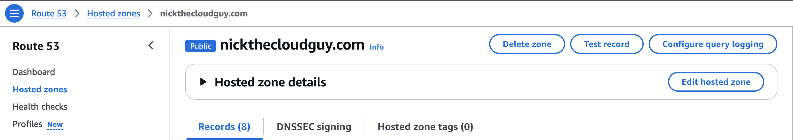

# Welcome to your CDK TypeScript project

This project demonstrates how to automate secure and scalable website deployment on AWS using Amazon CloudFront and AWS CDK. It is based on the AWS blog post: [Automating Secure and Scalable Website Deployment on AWS with Amazon CloudFront and AWS CDK](https://aws.amazon.com/blogs/apn/automating-secure-and-scalable-website-deployment-on-aws-with-amazon-cloudfront-and-aws-cdk/).

## Useful commands

* `npm run build`   compile typescript to js
* `npm run watch`   watch for changes and compile
* `npm run test`    perform the jest unit tests
* `npx cdk deploy`  deploy this stack to your default AWS account/region
* `npx cdk diff`    compare deployed stack with current state
* `npx cdk synth`   emits the synthesized CloudFormation template
* `npx cdk destroy`  destroy this stack that you have deployed


## AWS Setup for GitHub Actions

To enable GitHub Actions to interact with AWS resources, you need to set up an IAM role with the necessary permissions. This project includes the code to create the IAM role, but there is a prerequisite step you must complete manually.

### Prerequisite

Run the following command to create an OpenID Connect (OIDC) provider for GitHub:

```bash
aws iam create-open-id-connect-provider \
  --url https://token.actions.githubusercontent.com \
  --thumbprint-list 6938fd4d98bab03faadb97b34396831e3780aea1 \
  --client-id-list sts.amazonaws.com
```

This command establishes a trust relationship between AWS and GitHub Actions.

### IAM Role Setup

The `GithubCredsStack` in this project defines an IAM role for GitHub Actions. This role:

- Assumes a WebIdentityPrincipal using the OIDC provider.
- Grants permissions to interact with an S3 bucket (e.g., `PutObject`, `GetObject`, `ListBucket`, `DeleteObject`).

The role is automatically created when you deploy the stack using the CDK.

## Web Stack Overview

The `WebCdkStack` in this project is designed to deploy a secure and scalable website on AWS. It leverages several AWS services to ensure high availability, security, and performance.

### Prerequisite

Ensure that the domain you want to use for the website is registered with AWS Route 53. This is necessary for creating DNS records to map the domain name to the CloudFront distribution.

When you register a domain with AWS Route 53, AWS automatically creates a **hosted zone** for the domain. This hosted zone is essential for managing DNS records. Ensure that the hosted zone for your domain (e.g., `nickthecloudguy.com`) is present, as the stack looks up the zone by name during deployment.



### Key Features

1. **S3 Bucket for Website Hosting**
   - A public S3 bucket is created to host the website.
   - The bucket is configured with a website index document (`index.html`) and an error document (`200.html`).
   - Public access is restricted using `BlockPublicAccess` and `BucketAccessControl` settings.

2. **CloudFront Distribution**
   - A CloudFront distribution is set up to serve the website content securely over HTTPS.
   - The distribution uses a TLS/SSL certificate for secure communication.
   - It enforces HTTPS by redirecting HTTP requests.

3. **Route 53 DNS Records**
   - DNS records are created in Route 53 to map the domain name to the CloudFront distribution.
   - Both the root domain and subdomain (e.g., `dev.nickthecloudguy.com`) are supported.

4. **TLS/SSL Certificate**
   - A wildcard certificate is provisioned for the domain and its subdomains.

5. **Automated Deployment**
   - The website content is automatically deployed to the S3 bucket using the `BucketDeployment` construct.

### Deployment

To deploy the web stack, run the following command:

```bash
npx cdk deploy --all
```


### Output

After deployment, the ARN of the IAM role will be output. You can use this ARN in your GitHub Actions workflows to assume the role and interact with AWS resources.

After deployment, the outputs will include the S3 bucket name, CloudFront distribution ID, and other relevant details.
